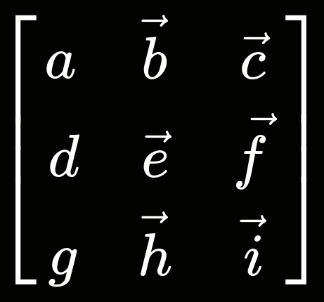
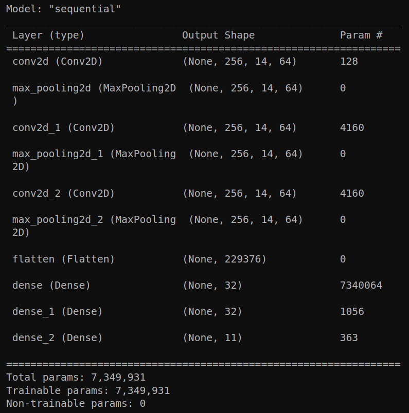

# PROBLEM STATEMENT & MOTIVATION
-----------------
-----------------

&nbsp;

Brain-Computer Interfaces (BCIs) can be extremely empowering for people with disabilities who choose to use them. There are a few commercially available EEG headsets, such as the Emotiv EPOC (pictured below) that provide less cost prohibitive, noninvasive options to convert electrical signals from the brain into computer commands that might be otherwise inaccessible to input for someone.


&nbsp;

This project aims to use some techniques from the field of data science to explore the feasibility of classiying EEG signals captured by a low cost, dry electrode system such as the Emotiv EPOC+. The data used was collected over nearly two years, 2014-15 and is [curated and hosted by the subject of the readings, David Vivancos](http://mindbigdata.com/opendb/index.html). Although four different datasets using four different devices are available, for this project I decided to analyze the one with the most channels, especially since it was the only one with electrode channels on the occipital lobe, which is the \"visual cortex.\" Lower cost options are available, such using a development board or microcontroller (\\\\$5 - \\\\$50) with an amplifier such as [this one](https://biosignals.berndporr.me.uk/#build_your_own_bio-amplifier), with electrodes from any supplier, which can be only [a few dollars](https://www.alibaba.com/product-detail/Colorful-Reusable-Gold-Cup-Electrodes-Cable_1600592681920.html)


# INSTALLATION OF REQUIRED PACKAGES

There are a few packages needed to run the code which can easily be installed with pip:

```
pip install -r requirements.txt
```

# SIGNAL PREPROCESSING
-----------------
-----------------


## Savitzky-Golay Filter


"The idea of Savitzky-Golay filters is simple – for each sample in the filtered sequence, take its direct neighborhood of N neighbors and fit a polynomial to it. Then just evaluate the polynomial at its center (and the center of the neighborhood), point 0, and continue with the next neighborhood."
-- https://bartwronski.com/2021/11/03/study-of-smoothing-filters-savitzky-golay-filters/

## Fast ICA


"Independent component analysis (ICA) is a statistical and computational technique for revealing hidden factors that underlie sets of random variables, measurements, or signals.

ICA defines a generative model for the observed multivariate data, which is typically given as a large database of samples. In the model, the data variables are assumed to be linear mixtures of some unknown latent variables, and the mixing system is also unknown. The latent variables are assumed nongaussian and mutually independent, and they are called the independent components of the observed data. These independent components, also called sources or factors, can be found by ICA."

-- https://www.cs.helsinki.fi/u/ahyvarin/whatisica.shtml

# Modeling & Results
-----------------
-----------------

A big difficulty with this dataset is the multidimensional encoding of the input. In the 'Data' column, each row is an entire vector of length ~256. The order of these vectors matter, but preserving it while preserving the order of events is a challenge.



Convolutional Neural Networks have been shown by Craik, et al, 2019, to have strong performance in EEG classification tasks. Here I implemented TensorFlow + Keras CNN model with three convolutional layers, three pooling layers, and three dense layers (one for output).


The accuracy of this model, even after filtering, unfortunately stayed around .102

The first iterations of the model were using data that was averaged per event. This effectively erased the time data, which is apparently crucial for neural coding (see this [video lecture by Earl Miller for more information on why](https://www.youtube.com/watch?v=Kqyhr9fTUjs)). This seems like it would be made worse by raw data being a measurement of changes in amlitude over time, even with filters. It might perform better the frequency information from Fourier transformation, but mean freqency without time would still lose a lot of information, other than perhaps the dominant frequency band of the channel.

The data vectors were then expanded out into seperate columns, making a very large training set input of shape (48775 x 3584). This was rejected by the CNN due to memory constraints on my local computer (Lenovo Y20). In the future, this could be resolved by cloud computing.
A simple SKLearn Support Vector Classifier did not have to handle a lot of data at once. After running for around six hours, it produced a slightly better score of 0.112 on the raw data. This implies to me that extensive denoising might be necessary in order to use this data set. Other groups analyzing the MindBigData digits dataset were not able to achieve much higher accuracy, e.g. the study of Pratama et al, 2021, only reached about 20% 

# Bibliography
-----------------
-----------------

- "Deep learning for electroencephalogram (EEG) classification tasks: a review", Alexander Craik, et al, 2019, J. Neural Eng. 16 031001, doi:10.1088/1741-2552/ab0ab5

- "Denoising Source Separation", Jaako Särelä & Harri Valpola, 2005, J. Machine Learning Res. 6, pp. 233-272, doi:10.5555/1046920.1058110

- "Frequency Band and PCA Feature Comparison for EEG Signal Classification", I Wayan Pio Pratama, et al, 2021, Lontar Komputer Vol. 12 No. 1, doi:10.24843/LKJITI.2021.v12.i01.p01

- "PIEEG: Turn a Raspberry Pi into a Brain-Computer-Interface to measure biosignals", Ildar Rakhmatulin & Sebastian Volkl, 2022, arxiv::2201.02228

- "Progress in Brain Computer Interface: Challenges and Opportunities", Simanto Saha, et al, 2021, Front. Syst. Neurosci., doi:10.3389/fnsys.2021.578875

- "Supply and demand analysis of the current and future US neurology workforce", Timothy M. Dall, et al, 2013, Neurology 81(5), doi:10.1212/WNL.0b013e318294b1cf

- "Toward Direct Brain-Computer Communication", Jacques J. Vidal, 1973, Ann. Rev Biophysics & Bioengineering, Vol. 2, pp. 157-180, doi:10.1146/annurev.bb.02.060173.001105

- "What is a Savitzky-Golay Filter?", Ronald W. Schafer, 2011, IEEE Sig. Proc. Mag July 2011, pp. 111-117, doi:10.1109/MSP.2011.941097

- Github repo listing many public EEG Datasets, including the one used in this project  https://github.com/meagmohit/EEG-Datasets

- List of papers that use/reference the MindBigData digits dataset on its website http://mindbigdata.com/opendb/index.html

- "meegkit: EEG and MEG denoising in Python" https://nbara.github.io/python-meegkit/ -- Unused but interesting EEG/MEG specific library

- "MNE, MEG + EEG Analysis & Visualization"  https://mne.tools/dev/index.html -- Another, much larger, neuro signal analysis library

- SciPy's signal processing library documentation https://docs.scipy.org/doc/scipy/reference/signal.html

- Website for Emotiv EPOC headset https://www.emotiv.com/epoc/ 


# Repository Structure

-------------------

Note: data folder only hosted locally, as the data generated from this project from trying different methods ended up being about 36GB.
If

```
├── workingCode                 <- Jupyter Notebooks and .py files of all the work for this project, including dead-ends as well as standalone files for data prep, signal processing, and modeling
├── images                      <- Images used anywhere in the project (slides, notebooks, etc)
├── .gitignore                  <- Rules to ignore by Github
├── index.ipynb			<- Jupyter Notebook containing exploration and analysis of our data
├── requirements.txt 		<- Library packages for pip to install
└── README.md                   <- This file

```


